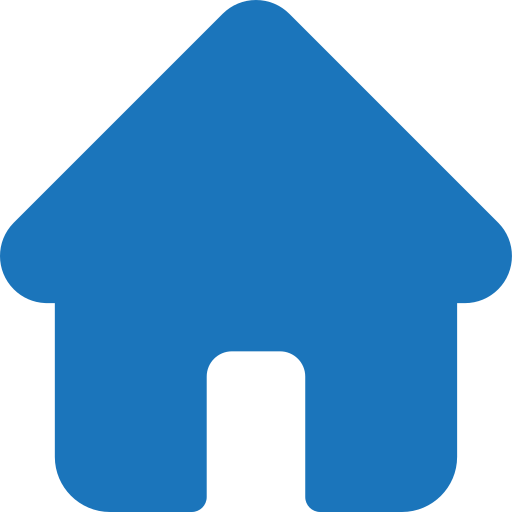

### Hi, I'm Ismail 👋

### Entrepreneur & Full Stack Developer
___
* ⚡ I've been working on asset management and tracking solutions since 2010
* ⚡ Love Tech education and am really passionate about continuous learning and teaching
* ⚡ Enjoy coding, solving challenges and developing algorithms
* ⚡ I'm founder of <a href="https://nawatt.com" target="_blank">Nawatt</a>, a great startup in the Middle East

<!--
**ialkamal/ialkamal** is a ✨ _special_ ✨ repository because its `README.md` (this file) appears on your GitHub profile.

Here are some ideas to get you started:

- 🔭 I’m currently working on ...
- 🌱 I’m currently learning ...
- 👯 I’m looking to collaborate on ...
- 🤔 I’m looking for help with ...
- 💬 Ask me about ...
- 📫 How to reach me: ...
- 😄 Pronouns: ...
- ⚡ Fun fact: ...
-->

### Connect with Me
___

### Tools & Technologies
___
          

### Github Stats
___

